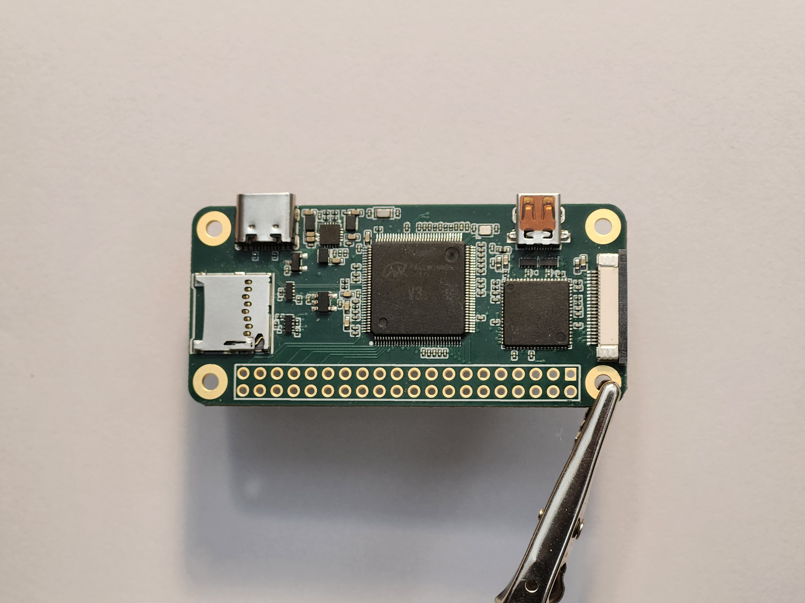
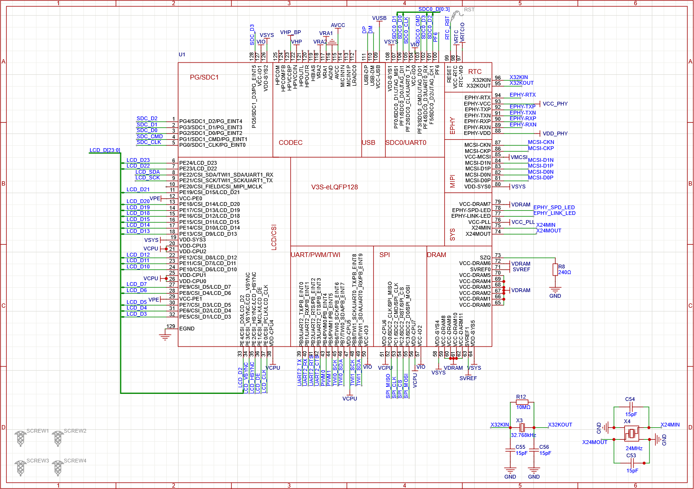
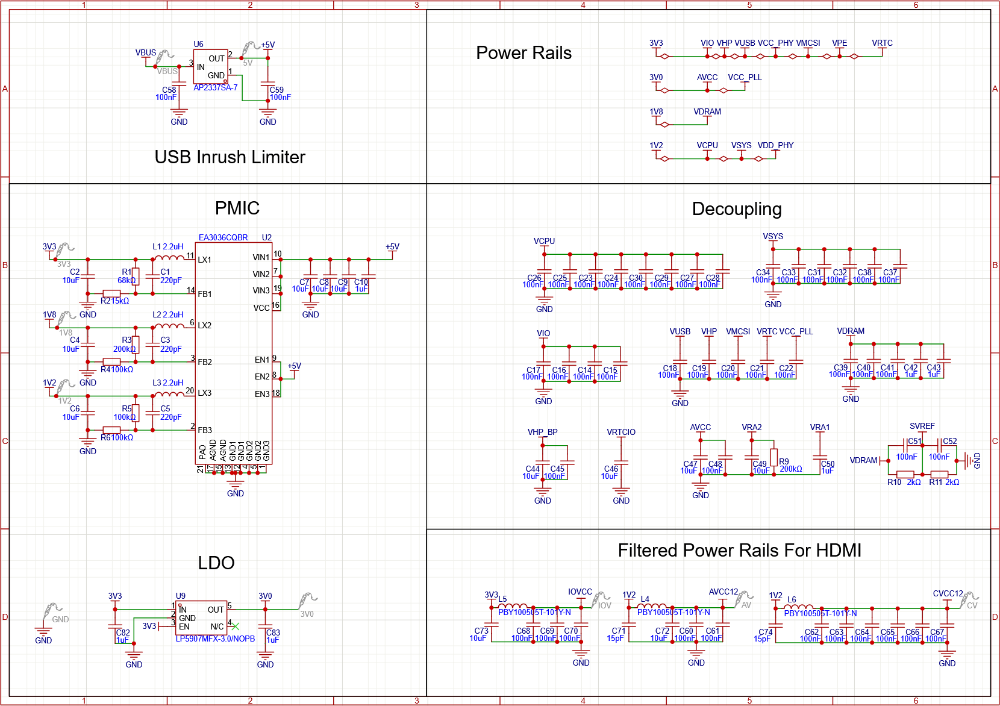
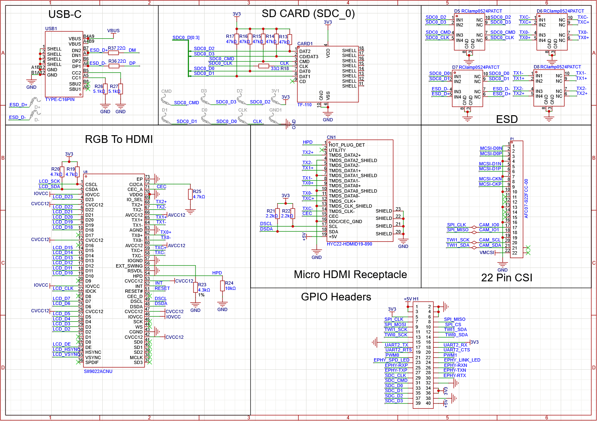
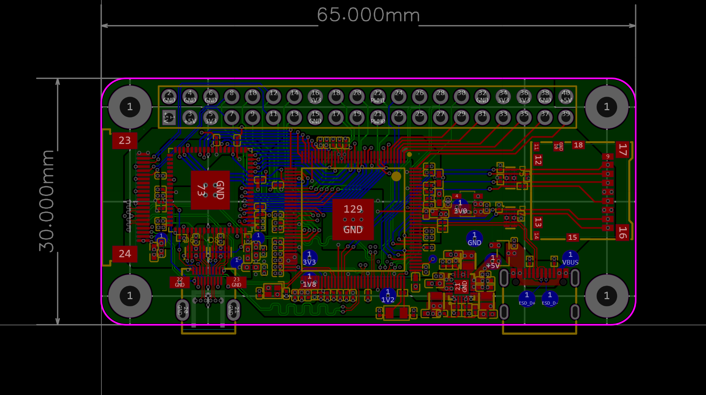

# V3S-SBC

A single board computer that uses the Allwinner V3s (Cortex-A7 1.2GHz, 64MB integrated DDR2) with SII9022ACNU converting parallel RGB to HDMI output!



I designed it as a minimal Linux-capable SBC, serving as a precursor to a digital camera project.  

The full design and build journey can be found in `Journal.md`.

## Features

- Allwinner V3s SoC (Cortex-A7 1.2GHz)
- 64MB Integrated DDR2
- Micro HDMI Output (RGB -> HDMI using SII9022ACNU)
- USB-C port for power
- Micro SD Slot
- MIPI-CSI 
- Raspberry Pi Zero Form Factor (Not pin compatible)

## Status

The board is confirmed to be working (partially). 
U-Boot can currently be loaded into RAM via FEL and executes correctly.  
Booting directly from SD card is not yet working and is under investigation. MMC interface shows up in U-Boot and SD card does get detected, just no luck successfully booting from it as of now.

The U-Boot with SPL file can be found under `/src/U-BOOT`

The board uses Lichee Pi Zero's `.dtb` file with minimal changes. Which I'll be adding soon after testing.

## Bring up

>I'll be releasing a more detailed bring up guide once I successfully get the board to fully work.

The board has been successfully brought up using FEL. U-Boot can be loaded into RAM and executed, but SD card boot is not yet functional.

#### Loading U-Boot via FEL

using [sunxi-fel](https://github.com/linux-sunxi/sunxi-tools):

```
sunxi-fel uboot u-boot-sunxi-with-spl.bin
```

After successfully flashing, U-Boot should appear over UART0 at 115200 baud.


## Hardware
### Schematic







### PCB



### Pinout


## License

This project is licensed under the CERN Open Hardware Licence Version 2 Weakly Reciprocal [(CERN OHL W)](LICENSE.txt)